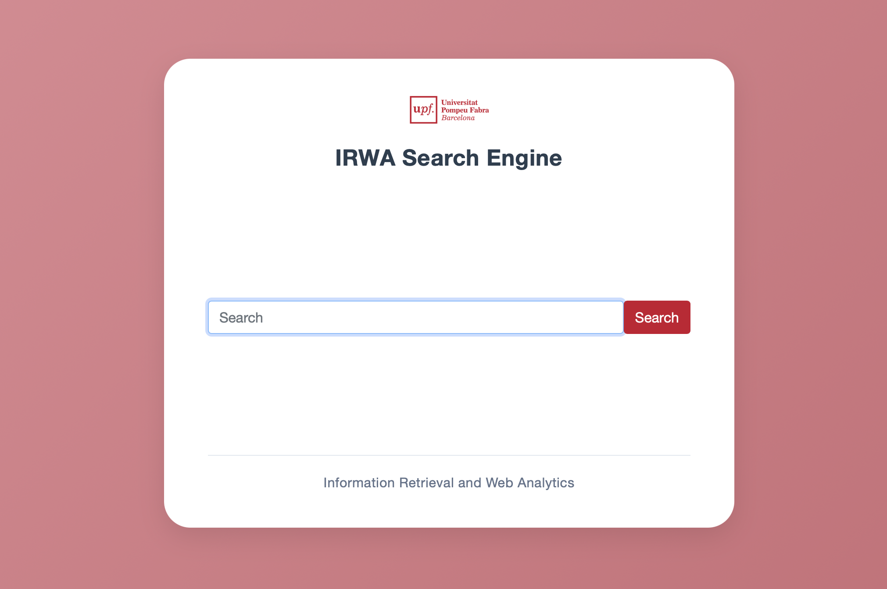

# Information Retrieval and Web Analytics (IRWA) - Final Project

<table>
  <tr>
    <td style="vertical-align: top;">
      
    </td>
    <td style="vertical-align: top;">
      This repository contains the code for the IRWA Final Project - Search Engine with Web Analytics.
      The project is implemented using Python and the Flask web framework. It includes a web application that allows users to search through a collection of documents and view analytics about their searches.
    </td>
  </tr>
</table>

----
## Project Structure

```
/IRWA-2025-part-4
├── myapp                # Contains the main application logic
│ ├── analytics/
│   └──  analytics_data.py
│ ├──  core/
│   └──  utils.py
│ ├──  generation/
│   ├──  rag.py
│   └──  rag_enhanced.py
│ └──  search/
│   ├──  algorithms.py
│   ├──  load_corpus.py
│   ├──  objects.py
│   └──  search_engine.py
├── templates/            # Contains HTML templates for the Flask application
│   ├──  base.html
│   ├──  dashboard.html
│   ├──  doc_details.html
│   ├──  index.html
│   ├──  results.html
│   ├──  settings.html
│   └──  stats.html
├── static               # Contains static assets (images, CSS, JavaScript)
│   ├──  styles/
│     ├──  bootstrap.min.css
│     ├──  bootstrap.min.css.map
│     └──  custom.css 
│   ├──  image.png       # image of the Web application offered as a template
│   └──  logo.png
├── data                 # Contains the dataset file (fashion_products_dataset.json)
│   ├──  fashion_products_dataset.json
│   └──  validation_labels.csv
├── project_progress     # Contains our solutions for Parts 1, 2, and 3 of the project
│   ├──  part_1/
│   ├──  part_2/
│   ├──  part_3/
│   └──  image.png       # image of our actual Web application
├── .env                 # Environment variables for configuration (e.g., API keys)
├── .gitignore           # Specifies files and directories to be ignored by Git
├── LICENSE              # License information for the project
├── requirements.txt     # Lists Python package dependencies
├── web_app.py           # Main Flask application
└── README.md            # Project documentation and usage instructions

```


----
## To download this repo locally

Open a terminal console and execute:
```
cd <your preferred projects root directory>
git clone https://github.com/Januto30/SearchEngine-IRWA_2025.git
```

## Setting up the Python environment
**Note: only for the first time you run the project**

### Install virtualenv
Setting up a virtualenv is recommended to isolate the project dependencies from other Python projects on your machine.
It allows you to manage packages on a per-project basis, avoiding potential conflicts between different projects.

In the project root directory execute:
```bash
pip3 install virtualenv
virtualenv --version
```

### Prepare virtualenv for the project
In the root of the project folder run to create a virtualenv named `irwa_venv`:
```bash
virtualenv irwa_venv
```

If you list the contents of the project root directory, you will see that it has created a new folder named `irwa_venv` that contains the virtualenv:
```bash
ls -l
```

The next step is to activate your new virtualenv for the project:
```bash
source irwa_venv/bin/activate
```

or for Windows...
```cmd
irwa_venv\Scripts\activate.bat
```

This will load the python virtualenv for the project.

### Installing Flask and other packages in your virtualenv
Make sure you are in the root of the project folder and that your virtualenv is activated (you should see `(irwa_venv)` in your terminal prompt).
And then install all the packages listed in `requirements.txt` with:
```bash
pip install -r requirements.txt
```

If you need to add more packages in the future, you can install them with pip and then update `requirements.txt` with:
```bash
pip freeze > requirements.txt
```

Enjoy!


## Starting the Web App
```bash
python -V
# Make sure we use Python 3

python web_app.py
```
The above will start a web server with the application:
```
 * Serving Flask app 'web_app'
 * Debug mode: on
WARNING: This is a development server. Do not use it in a production deployment. Use a production WSGI server instead.
 * Running on all addresses (0.0.0.0)
 * Running on http://127.0.0.1:8088
 * Running on http://192.168.xx.xx:8088
Press CTRL+C to quit
```

Open Web app in your Browser:  
[http://127.0.0.1:8088/](http://127.0.0.1:8088/) or [http://localhost:8088/](http://localhost:8088/)


## Usage: 
0. Copy and paste in the folder `IRWA-2025-part-4` the `data` folder from IRWA-2025-part-3 with the data files `fashion_products_dataset.json` and `validation_labels.csv` in it.
1. Make sure that you can see our results for Parts 1, 2, and 3 of the project, in the `project_progress` folder. Each part should contain `.pdf` file with our report and `.ipynb` (Jupyter Notebook) file with our code for solution and `README.md` with explanation of the content and instructions for results reproduction.
2. Make sure to update the `.env` file with your Groq API key (can be found [here](https://groq.com/), the free version is more than enough for our purposes) and any other necessary configurations. IMPORTANT: Do not share your `.env` file publicly as it contains sensitive information. It is included in `.gitignore` to prevent accidental commits. (It should never be included in the repos and appear here only for demonstration purposes).
3. Have fun and be creative with your queries!

## Showing visitor's IP
If you're curious and want to see the user's city and country displayed based on the IP address they're using to browse our search application, the setup should continue.

0. Install the Python library (in case you done have it):
Open a terminal console and execute:
```
source irwa_venv/bin/activate
pip install geoip2
```

1. Download the GeoLite2 database from MaxMind:
  1) Sign up for MaxMind (a free account is required).
  2) Download the GeoLite2-City_20251128.tar and .sha256 files.

2. Upload this file in the folder `IRWA-2025-part-4` and inspect the file type (see if it's a valid tar file or HTML)
```
file GeoLite2-City_20251128.tar
# (Optional) View first bytes to detect HTML if something is wrong
hexdump -C GeoLite2-City_20251128.tar | head -n 20
```
- If the file displays "POSIX tar archive", you're fine and can extract.
- If it displays "HTML" or "ASCII text", it means the download was from a login/error page.

3. To check the hash of the .tar file:
```
shasum -a 256 GeoLite2-City_20251128.tar
# and manually compare with the contents of GeoLite2-City_20251128.tar.gz.sha256 if applicable
cat GeoLite2-City_20251128.tar.gz.sha256 2>/dev/null || true
```

4. Extract the .tar ⁠ (if ⁠file said is tar)
```
tar -xf GeoLite2-City_20251128.tar
# for listing the extract files
ls -l
# search the .mmdb inside the extracted subdirectory
find . -maxdepth 3 -type f -name "GeoLite2-City.mmdb" -print
```

5. Move the⁠ .mmdb ⁠to the root of the project. There are two options for doing so:
- Manually, arrastrando el fichero desde la carpeta en la que se encuentra hasta la deseada.
- Supposing find returned ./GeoLite2-City_20251128/GeoLite2-City.mmdb
```
mv ./GeoLite2-City_20251128/GeoLite2-City.mmdb ./GeoLite2-City.mmdb
```
**Note: This file is already added to .gitignore for not versioning the DB.**

6. Set the environment variable for the app (temporary and persistent)
```
# temporal (valid only on this terminal)
export GEOIP_DB_PATH="$(pwd)/GeoLite2-City.mmdb"
# persistent in zsh (add it to ~/.zshrc)
echo 'export GEOIP_DB_PATH="$(pwd)/GeoLite2-City.mmdb"' >> ~/.zshrc
source ~/.zshrc
```
In case you have trouble for setting the persistent variable:
```
cp ~/.zshrc ~/.zshrc.backup
echo 'export GEOIP_DB_PATH="/path/to/your/GeoLite2-City.mmdb"' | sudo tee -a ~/.zshrc
grep -n GEOIP_DB_PATH ~/.zshrc || true
```
**Note: It will ask for a password. Introduce the password you use to log in in your computer.**
Reload zshrc in this terminal and display the variable
```
source ~/.zshrc
printf "GEOIP_DB_PATH=%s\n" "$GEOIP_DB_PATH"
ls -l ~/.zshrc
```

7. Make sure that the server is running with the version of the code that contains the X-Forwarded-For read.
```
# Make sure that you are within the virtual environment (if not run the following line)
source irwa_venv/bin/activate
```
```
export FLASK_APP=web_app.py
flask run --host=127.0.0.1 --port=8088
```

8. Open a new terminal to obtain a valid PID from the corpus to use in the test.
```
cd <your projects root directory>
source irwa_venv/bin/activate
python - <<'PY'
from web_app import corpus
# print the first 5 ids
print(list(corpus.keys())[:5])
PY
```⁠
Copy one of those IDs to use in the next request.

9. Simulate a request from a public IP address using X-Forwarded-For (example with 8.8.8.8), replacing <PID> with a real ID:
```⁠
curl -v -H "X-Forwarded-For: 8.8.8.8" "http://127.0.0.1:8088/doc_details?pid=<PID>"
```⁠
Look at the terminal where Flask is running, you should see the line we added: Recording click. remote_addr chosen for analytics: 8.8.8.8

10. Check the analytics endpoint to see the GeoIP resolution:
```⁠
curl -s http://127.0.0.1:8088/analytics/ips | jq .
```⁠⁠

**Note: When you test locally (127.0.0.1:8088 or 192.168.xx.xx:8088, private addresses) the geoip may not return city, that's normal.**

